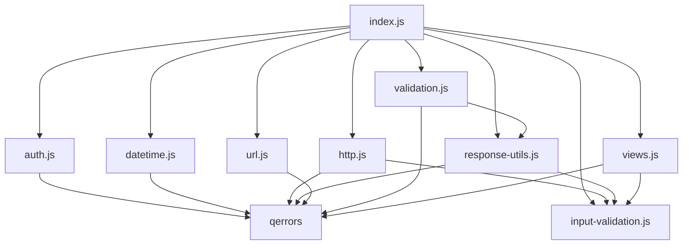
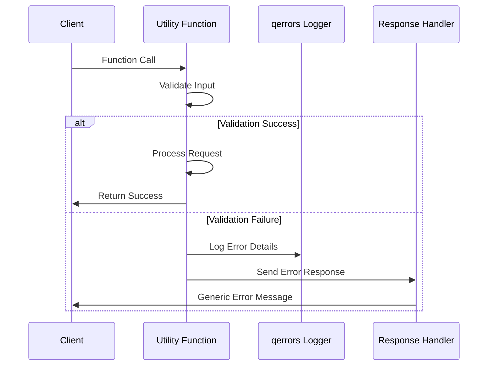

# QGenUtils Architecture Documentation

## Overview

QGenUtils is a lightweight, security-focused utility library for Node.js applications. The library follows a modular architecture with fail-closed security patterns and consistent error handling throughout all components.

## Single Responsibility Principle
The module architecture obeys SRP (Single Responsibility Principle),
each file encapsulates one concrete responsibility:
* One function per file so that any change in that behavior only ever touches that one file.
* Clear naming.
* Minimal imports/exports so that a file’s public interface is singular and dependencies stay tight.
* Easier reasoning for devs and LLM agents.
* Simpler testing (one test per file).
* Lower coupling (changes in “createUser” never ripple into “sendEmail”).
* Better AI‐friendliness (LLMs only load the 30 lines they need, not a 500-line blob), lowering token use.
* Easier assignment of parallel LLM editing that avoids merge conflicts

## Global Constants & Environment Variable Exporting
Theres a file `/config/localVars.js`, this file stores all hardcoded constants in the app so we have a single source of truth for variable names, 
and LLMs cannot mutate variable names. New values may be added, but existing values must not be modified, deleted, or moved. 
Values are grouped by category when first introduced. They are grouped under existing categories if they exists, or a new section 
(with a new comment header) if it’s a new category. Do not move or re-categorize existing values. 
Ensure that no duplicates or slight variations of existing values are added. All environment variables are defined here 
(example: export const envVar = process.env.ENV_VAR) and exported for use from here on the same line using the export keyword. 
No where else in the codebase should cite and use environment variables directly but should import them from here. 
Don't move or re-categorize existing values. If a variable/value is a duplicate or unused you may not delete it but may flag it & uncomment with a comment "REMOVE?". 
Remember in all this, never edit a constant once it resides in localVars.js; never create a section whose header already exists. 
When importing these variables into other files that use them, import the entire object and not just the variable needed 
(What I mean is import as: const localVars = require('../config/localVars'); and use as localVars.variable in context that use a variable. 
DO NOT import as: require const { variable } = require('../config/localVars'); as this becomes a huge and messy list.); 
this avoids merge conflicts that are huge and confusing to analyze the many imported variables from localVars.js. 
When you use a value in a file, doublecheck what that value is called in localVars.js EXACTLY to avoid hallucinating the variable name.

## Core Design Principles

### 1. Security-First Design
- **Fail-Closed Pattern**: All utilities default to the most secure state when errors occur
- **HTTPS-First**: URL utilities default to HTTPS for security
- **Header Cleaning**: HTTP utilities remove potentially dangerous headers
- **Generic Error Messages**: Public error responses never expose internal details

### 2. Modular Architecture
- **Domain Separation**: Each module handles a specific functional area
- **Independent Operation**: Modules can be used standalone or together
- **Minimal Dependencies**: Only essential external dependencies (qerrors, winston-daily-rotate-file)
- **Tree-Shakable**: Bundlers can optimize imports for minimal bundle size

### 3. Consistent Error Handling
- **Structured Logging**: qerrors integration for comprehensive error tracking
- **Graceful Degradation**: Errors don't crash applications
- **Developer-Friendly**: Detailed debugging information in logs
- **User-Friendly**: Generic public error messages

### 4. Performance Optimization
- **Lightweight Implementation**: ~15kB total vs 500kB+ for equivalent npm packages
- **Minimal Memory Footprint**: Efficient algorithms and data structures
- **Fast Execution**: Optimized code paths for common operations

## Module Architecture

```
QGenUtils/
├── index.js                 # Main entry point and exports
├── lib/
│   ├── auth.js             # Authentication utilities (Passport.js integration)
│   ├── datetime.js         # Date/time formatting and validation
│   ├── http.js             # HTTP request/response helpers
│   ├── input-validation.js # Type checking and object validation
│   ├── response-utils.js   # Standardized HTTP response patterns
│   ├── url.js              # URL manipulation and parsing
│   ├── validation.js       # Field validation and requirement checking
│   └── views.js            # Template rendering with error handling
└── tests/                  # Comprehensive test suite
    ├── unit/               # Individual module tests
    └── integration/        # Cross-module interaction tests
```

## Module Dependencies



## Security Architecture

### Authentication Layer (auth.js)
- **Fail-Closed Design**: Defaults to "not authenticated" on any error
- **Passport Integration**: Safe wrapper around Passport.js methods
- **Strategy Detection**: Runtime detection of configured OAuth strategies
- **Security Logging**: All authentication attempts are logged for auditing

### HTTP Security (http.js)
- **Header Cleaning**: Removes potentially dangerous headers from proxy requests
- **Content-Length Validation**: Prevents HTTP request smuggling
- **Protocol Enforcement**: Ensures proper HTTP/1.1 compliance

### URL Security (url.js)
- **HTTPS Default**: All URLs default to HTTPS unless explicitly specified as HTTP
- **Protocol Validation**: Prevents protocol injection attacks
- **Origin Normalization**: Consistent URL comparison to prevent bypass attacks

### Input Validation (input-validation.js, validation.js)
- **Type Safety**: Strict type checking for all inputs
- **Null/Undefined Handling**: Explicit handling of edge cases
- **Express Integration**: Safe validation of Express request/response objects

## Error Handling Architecture

### Three-Layer Error Strategy

1. **Detection Layer**: Catch errors at the source
2. **Logging Layer**: Structured logging with qerrors
3. **Response Layer**: User-friendly error responses

### Error Flow



## Performance Architecture

### Bundle Size Optimization
- **Custom Implementations**: Lightweight alternatives to heavy npm packages
- **Tree-Shakable Exports**: Bundlers can import only needed functions
- **Minimal Dependencies**: Reduces total dependency graph

### Memory Management
- **Object Cloning**: Shallow copies for header manipulation
- **String Processing**: Efficient regex patterns for URL processing
- **Error Objects**: Lightweight error structures

### Execution Efficiency
- **Early Returns**: Fail-fast validation patterns
- **Cached Computations**: Reuse expensive calculations where possible
- **Optimized Algorithms**: Efficient implementations for common operations

## Integration Patterns

### Express.js Integration
```javascript
const { checkPassportAuth, requireFields, sendJsonResponse } = require('qgenutils');

app.post('/api/users', (req, res) => {
  // Authentication check
  if (!checkPassportAuth(req)) {
    return sendAuthError(res);
  }
  
  // Field validation
  if (!requireFields(req.body, ['name', 'email'], res)) {
    return; // Error response already sent
  }
  
  // Process request...
  sendJsonResponse(res, 200, { success: true });
});
```

### Template Rendering Integration
```javascript
const { renderView } = require('qgenutils');

app.get('/dashboard', (req, res) => {
  renderView(res, 'dashboard', { user: req.user });
});
```

### URL Processing Integration
```javascript
const { ensureProtocol, parseUrlParts } = require('qgenutils');

const userUrl = ensureProtocol(req.body.website); // Defaults to HTTPS
const { baseUrl, endpoint } = parseUrlParts(userUrl);
```

## Testing Architecture

### Test Coverage Strategy
- **Unit Tests**: Individual function validation
- **Integration Tests**: Cross-module interaction testing
- **Error Path Testing**: Comprehensive error condition coverage
- **Security Testing**: Validation of fail-closed behaviors

### Test Structure
```
tests/
├── unit/                   # 92.69% statement coverage
│   ├── auth.test.js       # Authentication function tests
│   ├── datetime.test.js   # Date/time formatting tests
│   ├── http.test.js       # HTTP utility tests
│   ├── url.test.js        # URL manipulation tests
│   └── validation.test.js # Validation function tests
└── integration/           # Cross-module tests
    ├── error-handling.test.js
    └── module-interactions.test.js
```

## Deployment Architecture

### Production Considerations
- **Logging Configuration**: Winston daily rotation for production logs
- **Error Monitoring**: qerrors integration for error tracking
- **Performance Monitoring**: Built-in logging for performance analysis
- **Security Hardening**: Fail-closed patterns prevent security failures

### Scaling Patterns
- **Stateless Design**: All utilities are stateless for horizontal scaling
- **Memory Efficiency**: Low memory footprint supports high-concurrency applications
- **CPU Optimization**: Efficient algorithms minimize CPU usage

## Future Architecture Considerations

### Planned Enhancements
- **TypeScript Support**: Type definitions for better developer experience
- **Plugin Architecture**: Extensible validation and formatting plugins
- **Caching Layer**: Optional caching for expensive operations

### Backward Compatibility
- **Semantic Versioning**: Strict adherence to semver for updates
- **Deprecation Strategy**: Gradual migration path for breaking changes
- **Legacy Support**: Maintain compatibility with older Node.js versions

This architecture ensures QGenUtils remains lightweight, secure, and maintainable while providing comprehensive functionality for Node.js applications.